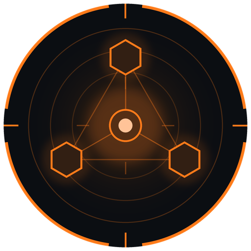
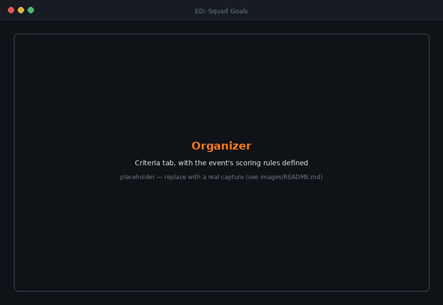
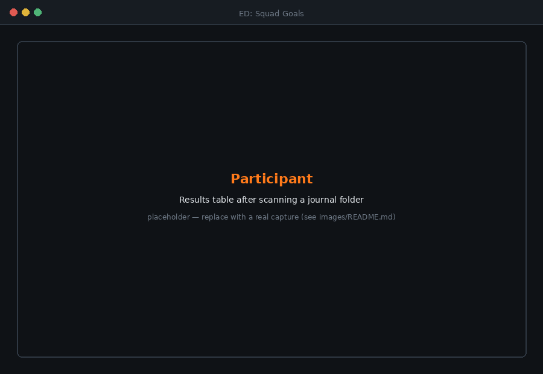
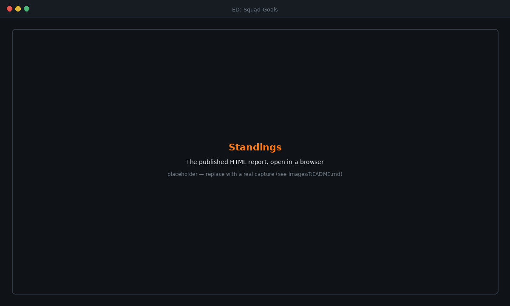

<div align="center">



# ED: Squad Goals
**Competitive event scoring for Elite Dangerous squadrons**

[](https://www.elitedangerous.com)
[]()
[](https://python.org)
[](https://www.qt.io/qt-for-python)
[]()

[](https://github.com/drworman/EDSG/actions/workflows/ci.yml)
[](https://github.com/drworman/EDSG/releases)
[](https://github.com/drworman/EDSG/stargazers)
[](https://github.com/drworman/EDSG/network/members)
[](LICENSE)

<ins>Run an event, score it from the journals</ins></br>
Define criteria · Issue a signed invitation · Collect submissions · Publish standings

<ins>Scored activities</ins></br>
Combat · Trade · Mining · Exploration · Exobiology · Missions · PowerPlay · Colonisation · any journal event

<ins>Two builds, one for each side</ins></br>
Organizer · Participant — Windows, macOS and Linux

<ins>Reports</ins></br>
JSON · Markdown · HTML · PDF

</div>

## Overview

EDSG runs competitive events between commanders without a server, an account,
or an API key. An organizer defines what counts, over what period, worth how
many points, and EDSG produces a **signed invitation**. Participants open it in
their own copy, point it at their journal folder, and get back a **signed
submission** containing only the totals the event asked for. The organizer
closes the event and publishes standings in four formats.

Nothing is uploaded anywhere. The only things that move between people are two
small files.

```
  ORGANIZER                      PARTICIPANT                    ORGANIZER
  ─────────                      ───────────                    ─────────
  define event                                                
  issue invitation  ──.edsgi──▶  verify signature
                                 scan own journals
                                 compile totals
                                 sign submission  ──.edsgs──▶   verify each file
                                                                rank commanders
                                                                close event
                                                                publish reports
```

## Screenshots

<div align="center">




<sub>Organizer building an event · Participant after scanning</sub>



<sub>Published standings, HTML report</sub>

</div>

## Two builds

| Build | Who runs it | What it does |
|---|---|---|
| **EDSG-Organizer** | The person running the event | Defines criteria, issues invitations, closes events, publishes standings |
| **EDSG-Participant** | Everyone taking part | Verifies an invitation, scans journals, produces a submission |

The organizer build has dominion: it alone decides what is measured and what
the final standings are.

## Install

Download the archive for your platform from
[Releases](https://github.com/drworman/EDSG/releases), unpack it, and run the
binary. Nothing else is required — Python and Qt are inside.

- **Windows** — `EDSG-Organizer.exe` / `EDSG-Participant.exe`
- **macOS** — `.app` bundles; signed and notarised when release credentials are
  configured, otherwise right-click → Open on first launch
- **Linux** — `chmod +x` and run

Prefer to build it yourself? See [docs/BUILDING.md](docs/BUILDING.md).

## Quick start

### Organizers

1. **Event** — name the event, set the UTC period, choose who may take part.
   For a squadron-only event, click *Detect from my journals* and EDSG reads
   your own logs to identify your squadron. You never type an ID.
2. **Criteria** — add one criterion per thing you want to measure. Each pairs a
   metric with optional filters and a points value. See
   [docs/CRITERIA.md](docs/CRITERIA.md).
3. **Issue invitation** — EDSG signs the event and writes a `.edsgi` file.
   Send it to your participants along with your **signing fingerprint**, shown
   on that tab, so they can confirm it came from you.
4. **Close & publish** — collect the `.edsgs` files into one folder, then close
   the event. Closing is permanent. Reports can be regenerated at any time as
   long as you keep that folder.

### Participants

1. Open the `.edsgi` file your organizer sent. EDSG verifies its signature and
   shows you the rules and the organizer's fingerprint before anything else.
2. Point it at your Elite Dangerous journal folder. EDSG usually finds it
   automatically, including Steam Proton and Wine prefixes on Linux.
3. Click **Scan my journals**.
4. Send the resulting `.edsgs` file — named for your Frontier ID — to your
   organizer.

## What can be scored

Fourteen metrics, each combinable with filters for systems, stations, station
types, market IDs, commodities, factions, mission names and outcomes, genera
and species, and powers.

| | |
|---|---|
| **Mining** | Ore refined, by commodity and location |
| **Trade** | Commodities bought and sold, by tonnage or credits, filtered to a specific station, system or fleet carrier |
| **Exploration** | Bodies scanned and surface-mapped, first discoveries only if you like, systems visited, cartographic data sold |
| **Exobiology** | Samples analysed and biological data sold, by genus or species |
| **Combat** | Bounty vouchers and combat bonds, by count or credit value |
| **Missions** | Completions, failures and abandonments, filtered by name, faction or destination |
| **Powerplay** | Merits earned for a pledged power |
| **Colonisation** | Commodities delivered to construction sites, and builds seen through to completion |
| **Anything else** | A catch-all metric counts *any* journal event by name — including event types Frontier has not shipped yet |

Each criterion can carry a **cap** so one runaway category cannot decide an
event, and a **minimum** that must be reached before it scores at all.

## What EDSG reads, and what it shares

EDSG reads only `Journal.*.log` files, on the local machine. It does not read
live-state files, modify the game, inject code, read process memory, or talk to
Frontier's servers.

A submission contains the commander's name, their Frontier ID, the totals for
each criterion, a small sample of matching events as an audit trail, and scan
diagnostics. It does not contain the journals themselves.

## On trust

Signatures prove a file has not been altered **in transit**: an invitation is
the one the organizer issued, and a submission is byte-for-byte what the
participant generated. Tampering with either is detected and reported.

Signatures cannot prove a participant's *journals* were unaltered. Those are
plain text files on their own computer. EDSG is built for events among
commanders who broadly trust each other, and the standings report exposes the
evidence — per-commander event counts, scan diagnostics, signing fingerprints —
that an organizer needs to notice something implausible.
[docs/SECURITY.md](docs/SECURITY.md) is explicit about this.

## Documentation

| | |
|---|---|
| [Organizer guide](docs/USAGE_ORGANIZER.md) | Running an event start to finish |
| [Participant guide](docs/USAGE_PARTICIPANT.md) | Taking part |
| [Criteria reference](docs/CRITERIA.md) | Every metric, measure and filter |
| [Colonisation & Operations](docs/COLONISATION_AND_OPERATIONS.md) | What is scoreable in the newest features, and what is not |
| [File formats](docs/FILE_FORMATS.md) | The `.edsgi` and `.edsgs` schemas |
| [Security model](docs/SECURITY.md) | What signing does and does not prove |
| [Architecture](docs/ARCHITECTURE.md) | How the code is laid out |
| [Building](docs/BUILDING.md) | Building binaries yourself |
| [Licensing](docs/LICENSING.md) | MIT, and the Qt LGPL obligations |
| [Themes and branding](docs/THEMES.md) | Palettes, custom colours, squadron identity on reports |
| [Contributing](CONTRIBUTING.md) | Conventional Commits, versioning, tests |

## Command line

Both binaries accept `--cli` for scripting and troubleshooting:

```bash
EDSG-Participant --cli inspect event.edsgi     # verify and describe a file
EDSG-Participant --cli commander ~/journals    # who owns this folder
EDSG-Organizer   --cli squadron  ~/journals    # detect your squadron
EDSG-Organizer   --cli close event.json --submissions ./subs --out ./reports
```

## Licence

ED: Squad Goals is released under the **MIT licence** — see [LICENSE](LICENSE)
for the full text.

Copyright © 2026 David R. Worman.

The `LICENSE` file contains the licence text and nothing else, so GitHub can
identify it automatically. The attribution and disclaimers that belong
alongside it are below rather than in that file.

### Bundled components

The distributed binaries include third-party code under its own terms:

| Component | Licence |
|---|---|
| Qt for Python (PySide6) and Qt | LGPL v3 |
| cryptography | Apache 2.0 |
| ReportLab | BSD 3-Clause |
| Pillow (organizer build only) | MIT-CMU |

Qt is dynamically linked and never statically linked, and the licence texts
ship inside every binary. [THIRD-PARTY-NOTICES.md](THIRD-PARTY-NOTICES.md)
gives the full notices, and [docs/LICENSING.md](docs/LICENSING.md) explains
how the LGPL obligations are met and what they mean if you fork the project.

### Trademarks and affiliation

Elite Dangerous is a trademark of Frontier Developments plc.

**ED: Squad Goals is an unofficial community tool. It is not affiliated with,
endorsed by, or supported by Frontier Developments plc.**

EDSG reads the journal files the game writes to the local filesystem, in the
format Frontier documents for exactly this purpose. It does not modify the
game, inject code, read process memory, or interact with Frontier's servers.

### No warranty

EDSG is provided "as is", without warranty of any kind, as set out in the
MIT licence. Signatures on invitations and submissions protect those files in
transit; they cannot attest that a participant's journal files were
themselves unmodified. See [docs/SECURITY.md](docs/SECURITY.md) for what the
signing does and does not prove.
